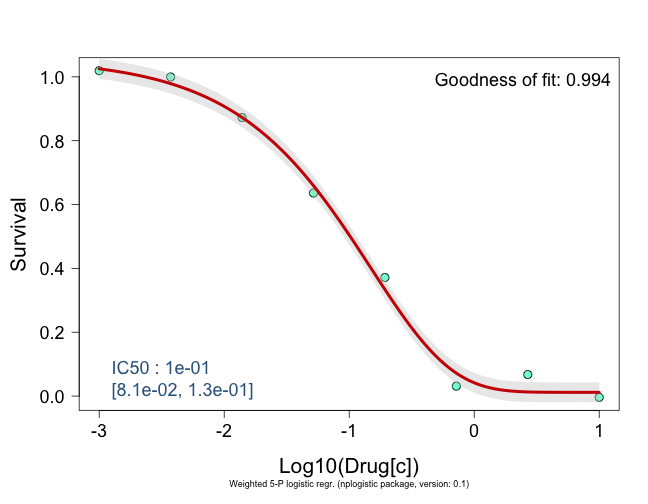
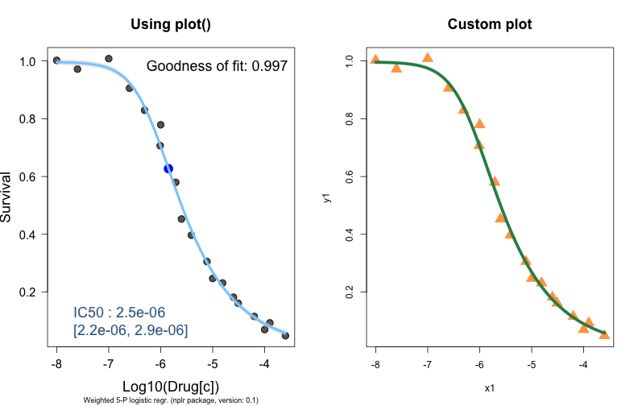
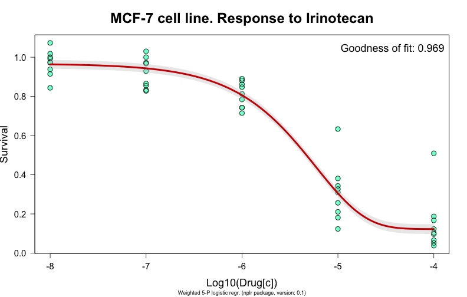
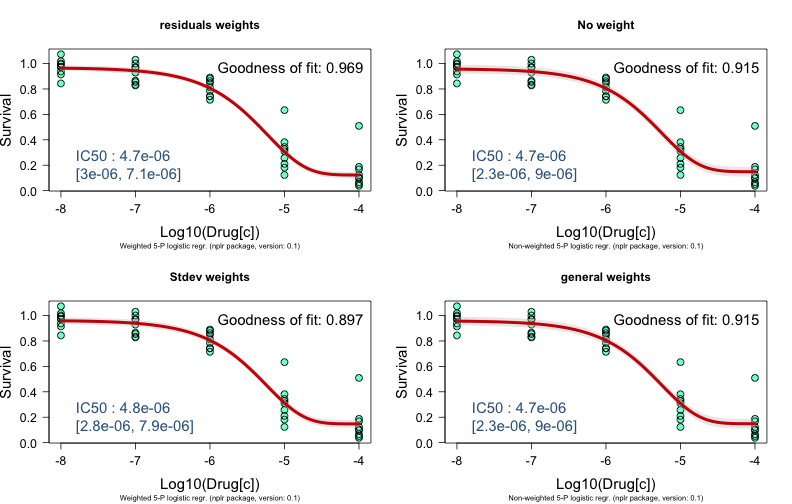
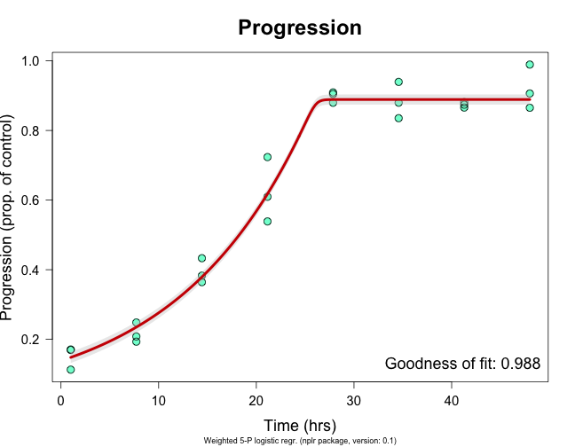
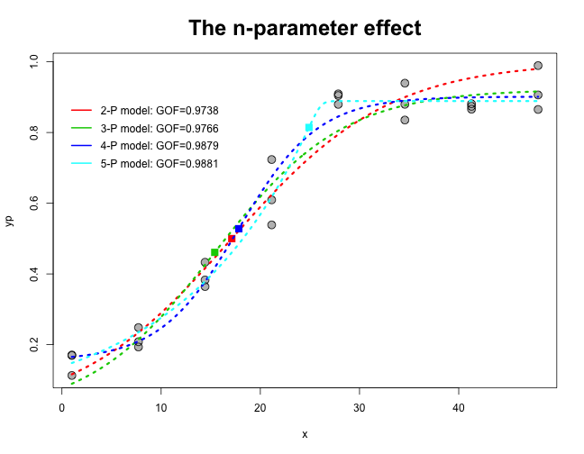

%\VignetteEngine{knitr::knitr}
# nplr Vignette

### AUTHORS: _Frederic Commo (fredcommo@gmail.com) & Brian M. Bot_

### 1- Introduction

The $nplr$ package provides functions to compute a weighted n-parameter logistic regression, n from 2 to 5, and to estimate x values corresponding to some given targets.  
Typical applications are drug-response or progression curve fitting.

The n-parameter logistic regression used by $nplr$ is of the form:

$$y = B + \frac{T - B}{[1 + 10^{b.(xmid - x)}]^s}$$

Where $B$ and $T$ are the bottom and top asymptotes, respectively, $b$ and $xmid$ are the Hill slope and the x-coordinate at the inflexion point, respectively, and $s$ is an asymetric coefficient. This equation is sometimes refered to as a 5-parameter logistic regression, or the Richards equation.  
The $npars$ argument allows a user to run simplest models, while the default value $npars='all'$ asks the function to test which model fits the best the data, with respect to a weighted Goodness-of-Fit estimator. See the $nplr$ documentation for more details.

The $nplr()$ function has been optimized for fitting curves on y-values passed as proportions of control, between 0 to 1. If data are provided as original response values, e.g. optic density measurements, the $convertToProp()$ function may be helpful. In drug-response curve fitting, a good practice consists in adjusting the signals on a $T_0$ and a $control$  (Ctrl) values. Providing this values, the proportion values, $y_p$, are computed as:

$$y_p = \frac{y - T_0}{Ctrl - T_0}$$

Note that if neither $T_0$ nor $Ctrl$ are provided, the default behaviour of $convertToProp()$ is to adjust the values as proportions of their $min$ and $max$. In that case, the user should be aware that $y = 0.5$ does not correspond to the $IC50$, but to the $EC50$, as shown in the examples below.

In some situations, the x values may need to be log-transformed, e.g. x is provided as original drug concentrations. In such case, setting $useLog=TRUE$ in $nplr()$ will apply a $Log_10$ transformation on the x values.  
Other arguments are described in the $nplr$ documentation.

In a drug-response (or progression) curve fitting context, typical needs are to invert the function in order to estimate the x value, e.g. the IC50, given a y value (the 0.5 survival rate). To do so, the implemented $getEstimates()$ method takes 2 arguments: the model (an instance of the class nplr), and one (or a vector of) target(s). $getEstimates()$ returns the corresponding x values and their estimated 95% confidence intervals.

A specific $plot()$ function has been implemented in order to visualize the results, using predefined plotting parameters. An easy way to draw simplest, or customized, plots is described in the examples below.

Finally, several self-explanatory $get$ functions give an easy access to the results, model parameters and model performances stored in the $nplr()$ output.

The examples below use some of the NCI-60 Growth Inhibition Data. For the purpose of the following examples, the provided drug concentrations have been re-exponentiated.  
The full data can be downloaded at https://wiki.nci.nih.gov/display/NCIDTPdata/NCI-60+Growth+Inhibition+Data}.  


## Examples


The first example fits a simple drug-response curve: the PC-3 cell line treated with Thioguanine, 19 points without replicates.

```r
path <- system.file("extdata", "pc3.txt", package = "nplr")
pc3 <- read.table(path, header = TRUE)
np1 <- nplr(pc3$CONC, pc3$GIPROP)
```

```
Testing pars
5-Parameters model seems to have better performance.
```

```r
plot(np1, main = "PC-3 cell line. Response to Thioguanine", cex.main = 2)
```




Once the model is built, several accessor functions allow to get access to the parameters and performances of the model.

```r
getGoodness(np1)
```

```
[1] 0.9969
```

```r
getPar(np1)
```

```
$npar
[1] 5

$params
     bottom    top   xmid   scal      s
1 0.0001829 0.9965 -6.183 -1.428 0.3352
```


But the purpose of the fitting is to estimate the response to the drug.  
The $getAUC()$ function returns the area under the curve (AUC) estimated by the trapezoid rule and the Simpson's rule.  
The $getEstimates()$ invert the function and returns the estimated concentration for a given response.  If no target is specified, the default output is a table of the x values corresponding to responses from 0.9 to 0.1.

```r
getAUC(np1)
```

```
  trapezoide Simpson
1      2.507   2.527
```

```r
getEstimates(np1)
```

```
    y     x05       x     x95
1 0.9 2.3e-07 3.2e-07 4.0e-07
2 0.8 5.2e-07 6.2e-07 7.3e-07
3 0.7 8.8e-07 1.0e-06 1.2e-06
4 0.6 1.4e-06 1.6e-06 1.8e-06
5 0.5 2.2e-06 2.5e-06 2.9e-06
6 0.4 3.6e-06 4.2e-06 5.1e-06
7 0.3 6.4e-06 7.9e-06 9.9e-06
8 0.2 1.4e-05 1.9e-05 2.7e-05
9 0.1 4.6e-05 8.0e-05 1.7e-04
```

```r
getEstimates(np1, c(0.25, 0.5, 0.75))
```

```
     y     x05       x     x95
1 0.25 9.1e-06 1.2e-05 1.5e-05
2 0.50 2.2e-06 2.5e-06 2.9e-06
3 0.75 6.9e-07 8.0e-07 9.3e-07
```


A $plot()$ function has been specifically implemented for objects of the class $nplr$. This function has several predefined graphical parameters, and not all can be overwritten.  
However, a convenient way to draw simplest or customized plots is shown in the example below:

```r
op <- par(no.readonly = TRUE)
par(mfrow = c(1, 2))
plot(np1, pcol = "grey40", lcol = "skyblue1", showTarget = 0.5, showInfl = TRUE, 
    main = "Using plot()", cex.main = 1.5)
x1 <- getX(np1)
y1 <- getY(np1)
x2 <- getXcurve(np1)
y2 <- getYcurve(np1)
plot(x1, y1, pch = 17, cex = 2, col = "tan1", main = "Custom plot", cex.main = 1.5)
lines(x2, y2, lwd = 5, col = "seagreen4")
```



```r
par(op)
```


The next example analyses a drug-response experiment with replicated drug concentrations: the MCF-7 cell line treated with Irinotecan.

```r
path <- system.file("extdata", "mcf7.txt", package = "nplr")
mcf7 <- read.table(path, header = TRUE)
np2 <- nplr(mcf7$CONC, mcf7$GIPROP)
```

```
Testing pars
5-Parameters model seems to have better performance.
```

```r
plot(np2, main = "MCF-7 cell line. Response to Irinotecan", cex.main = 2)
```




As there are replicates, we can compare the effect of the different weighted methods with the default $residuals weights$, on the fitting:

```r
noweight <- nplr(mcf7$CONC, mcf7$GIPROP, LPweight = 0, silent = TRUE)
sdw <- nplr(mcf7$CONC, mcf7$GIPROP, method = "sdw", silent = TRUE)
gw <- nplr(mcf7$CONC, mcf7$GIPROP, method = "sdw", LPweight = 1.5, silent = TRUE)
par(mfrow = c(2, 2))
plot(np2, showTarget = 0.5, main = "residuals weights")
plot(noweight, showTarget = 0.5, main = "No weight")
plot(sdw, showTarget = 0.5, main = "Stdev weights")
plot(noweight, showTarget = 0.5, main = "general weights")
```



```r
par(op)
```


This last example illustrates a Time/progression experiment: these are simulated data.

```r
path <- system.file("extdata", "prog.txt", package = "nplr")
prog <- read.table(path, header = TRUE)
```


Progression values are given in some unknown unit. But as we have access to a $T_0$ value, and a $control$ value as well, we can use $convertToProp()$ in order to convert the data to proportions. Here, the x values are $Time$ in hours, and we don't want to use $Log_10$ transformations.  
When progression is at stake, it may be interesting to get the  coordinates of the $inflexion point$, as this is where the slope (progression) is maximal.

```r
x <- prog$time
yp <- convertToProp(prog$prog, 5, 102)
np3 <- nplr(x, yp, useLog = FALSE)
```

```
Testing pars
5-Parameters model seems to have better performance.
```

```r
plot(np3, showTarget = FALSE, xlab = "Time (hrs)", ylab = "Progression (prop. of control)", 
    main = "Progression", cex.main = 2)
```



```r

getInflexion(np3)
```

```
     x      y
1 24.9 0.8144
```

```r
getEstimates(np3, c(0.25, 0.5, 0.75))
```

```
     y  x05    x x95
1 0.25  5.2  8.6  11
2 0.50 17.0 18.0  20
3 0.75 23.0 24.0  25
```


When a 5-p logistic regression is used, and because of the asymetric parameter, the curve is no longer symetrical around its inflexion point. Here is an illustration of the impact of the number of parameters on the fitting.

```r
plot(x, yp, pch = 19, col = "grey", cex = 1.5, main = "The n-parameter effect", 
    cex.main = 2)
points(x, yp, cex = 1.6)
for (i in 2:5) {
    test <- nplr(x, yp, npars = i, useLog = FALSE)
    lines(getXcurve(test), getYcurve(test), lwd = 3, lty = 3, , col = i)
    points(getInflexion(test), pch = 15, cex = 1.5, col = i)
    gof <- getGoodness(test)
    legend(0, 1 - i/20, legend = sprintf("%s-P model: GOF=%s", i, round(gof, 
        4)), lwd = 2, col = i, bty = "n")
}
```




$Note that even if it is the case here, the 5-P model is not systematically the best choice.$


## References
Richards, F. J. (1959). A flexible growth function for empirical use. J Exp
Bot 10, 290–300.

Giraldo J, Vivas NM, Vila E, Badia A. Assessing the (a)symmetry of
concentration-effect curves: empirical versus mechanistic models. Pharmacol Ther.
2002 Jul;95(1):21-45.

Motulsky HJ, Brown RE. Detecting outliers when fitting data with nonlinear
regression - a new method based on robust nonlinear regression and the false
discovery rate. BMC Bioinformatics. 2006 Mar 9;7:123.


```r
sessionInfo()
```

```
## R version 3.0.1 (2013-05-16)
## Platform: x86_64-apple-darwin10.8.0 (64-bit)
## 
## locale:
## [1] fr_FR.UTF-8/fr_FR.UTF-8/fr_FR.UTF-8/C/fr_FR.UTF-8/fr_FR.UTF-8
## 
## attached base packages:
## [1] stats     graphics  grDevices utils     datasets  methods   base     
## 
## other attached packages:
## [1] RCurl_1.95-4.1 bitops_1.0-6   nplr_0.1       knitr_1.5     
## 
## loaded via a namespace (and not attached):
## [1] evaluate_0.5.1 formatR_0.10   stringr_0.6.2  tools_3.0.1
```

